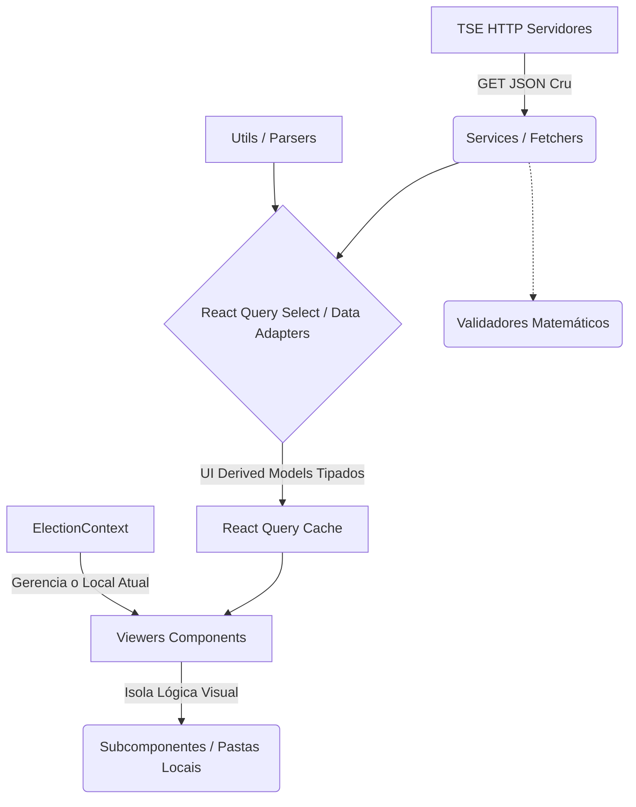

# Arquitetura Atual do Projeto (Pós-Fase 4B)

Este documento descreve a arquitetura **realmente observada** no código do projeto Eleições PWA após a completa consolidação das Fases 3, 4A e 4B de refatoração, servindo como base técnica atual.

## 1. Visão Geral da Arquitetura
A aplicação é uma SPA (Single Page Application) baseada em React e Vite. Seu principal objetivo é ler arquivos JSON estáticos do Tribunal Superior Eleitoral (TSE) e exibi-los em tempo real de forma legível e ágil, com polling assíncrono efêmero em 30 segundos, ou a partir de JSON locais off-grid.

**Diagrama de Arquitetura Geral**

## 2. Principais Camadas e Módulos
1. **Páginas (`src/pages`)**: Ponto de entrada das rotas.
2. **Serviços (`src/services`)**: Módulo de comunicação puramente HTTP com a API (`*Service.ts`) e módulo de auditoria contábil matemática background paralela (`*Validator.ts`).
3. **Estado Global (`src/context`)**: O orquestrador da aplicação (`ElectionContext.tsx`), que decide qual eleição, município e zona o usuário está explorando naquele momento.
4. **Adapters e Utils (`src/utils`)**: Funções unificadas independentes de estado. Arquivos na pasta `adapters/` interceptam requisições injetando cálculos cruciais formatados já numéricos sem destruir as keys originais. Utilitários geográficos e comportamentais moram livremente na raiz dessa pasta.
5. **Componentes/Viewers (`src/components`)**: O front-end de painéis principais (`EA14Viewer`, `EA20Viewer`), suportados fortemente por dezenas de Componentes "Dumb" encadeados localmente para UI limpa.

## 3. Responsabilidades por Camada
- **`services/*Service.ts`**: Fazer `fetch`. Recebe a string JSON oficial da API sem realizar casting lógico interno.
- **`services/*Validator.ts`**: Rodar regras de consistência matemática pesadas e puras. Emitir arrays de *Strings* sobre erros críticos; independente, não bloqueando threads da UI.
- **`utils/adapters/*Adapters.ts`**: (Nova Camada) Ponto nevrálgico. Atua no `select` do TanStack React Query. Gera novos objetos (ex: `UI_EA20Response`) cujas raízes são uma cópia 1:1 purificada da árvore TSE cruzada com novas variáveis fixas em sufixo `_NomeNum` originárias de parsings rigorosos em JS Number.
- **`components/*Viewer.tsx`**: Pura camada de consumo visual. Executam mapas de arrays e delegam sub-árvores para pasta filhas como `src/components/ea20/SummaryCards.tsx`. Controlam inputs e ordenações na sua RAM local.
- **`context/ElectionContext.ts`**: Exclusivamente aponta coordenadas geográficas mantendo histórico via localStorage. Fornece métodos puramente de reset universal (`clearSelection()`) e swaps semânticos lógicos de tempo de votação (`switchTurno()`).

## 4. Avanços e Tratamentos de Fragilidades Previas
- **Desacoplamento de Tipagem e Parse:** Painéis de visualização (ex. EA20) pararam definitivamente de mastigar strings brasileiras (`"1.450,30"`) e engasgar em calculos repetitivos `parseFloat()` do React em cada render keyframe. Tudo baseia-se nos `Adapters` derivados na pré-alocação do Cache.
- **Resolução Fat-Component:** A monolítica tabela do *EA20 Viewer* (anteriormente muito densa) foi parcialmente segregada. Ela delega componentes puramente textuais de cards, tabelas proporcionais e gráficos a subcomponentes presentes na pasta estrita `src/components/ea20`.
- **Mitigação de Dívida Técnica (Tipagem):** Redução maciça da evasão técnica por `any` no escopo principal, forçando uma coesão de contrato mais confiável com a base do Model API.

## 5. Decisões Arquiteturais Implícitas
- **Fonte da Verdade Simultânea Mestra do Contrato TSE:** Ao introduzir o *UI Data Adapter* no framework, fixou-se o modelo de extensão. `Object.assign({}, raw, { ...novoscampos })`. Os Types do app cruzam e unem a interface intocada de String Brasileira lado a lado as Variáveis Float processadas com prefixo "Underline", atendendo tanto auditorias forenses (o valor original) como as exigências matemáticas relativas eficientes UI .
- O uso forte do **React Query** sobre Zustands se reafirmou, limitando o `State Global` ao mero cordenador da Busca, deixando a rede atuar passivamente como a store de fatos.

## 6. O Que Foi Preservado
- A interceptação inicial estendida pelo `Adapter` atrelada à query de rede sem perder na integridade de base o `API Models` puro recebido do payload.
- A divisão dos Visualizadores (Brasil `EA14`, UF/State `EA15`, Zone `EA20`), garantindo que a base de componentes evite Prop Drilling excessivo na navegação raiz.

## 7. Oportunidades Futuras (Separadas do Escopo Concluído)
- Virtualização agressiva de janelas (`react-window`) para render listagens colossais numéricas no EA20Viewer ao invés de iterar puramente nós longos do DOM local.
- Desengatar o array de UI visual de estado de filtros textuais do Painel Principal, usando um hook isolado de interface para as *Filter Pills*.
