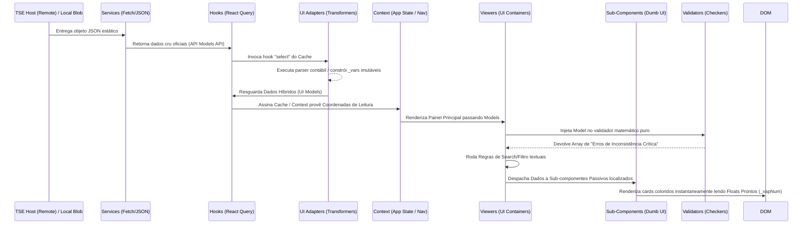

# Fluxo de Dados da Aplicação (Pós-Fase 4B)

O projeto Eleições PWA consiste na visualização ágil, segura e em tempo real dos arquivos JSON de Resultados Oficiais providos pelo Tribunal Superior Eleitoral (TSE).

## Diagrama do Fluxo de Dados (TSE até Renderização Componentizada)

## Pontos Estratégicos do Fluxo Refatorado

### 1. Extremos de Origem: Online Pollings vs Arquivo Local
- **Rotina Padrão Network:** Origem puramente na infraestrutura TSE via requisição REST perene aos servidores estáticos remotos configurados no Painel.
- **Rotina Override (Auditoria Offline):** Em modo Sandboxed sem internet, o usuário despacha arquivos `EA14`, `EA15` ou `EA20` pelo Header. Os Blobs invadem os Modais saltando `Services` inteiramente.
- **Rotina de Edição (JSON Editor):** Ao salvar alterações no editor visual, o JSON stringificado é re-parseado e forçado através do `adaptEA20Response`, garantindo a atualização imediata dos contadores e estilos baseados em propriedades computadas.
  *(Aprimoramento 4B)*: Arquivos locais no ato da Dropzone são forçados pela interceptação manual aos mesmos métodos `Adapters`, mantendo a igual tipagem rígida unificada de leitura em Componentes do que os canais Online.

### 2. A Camada "UI Adapters" (Fase 4B)
- Diferente do design rudimentar do nascimento do app que empurrava JSON cru para toda interface, o *Data Adapter* surge na borda do *Data Fetching* (React Query Select).
- Esse "middleware contábil efêmero" percorre a árvore, limpa as virgulas em JS nativo estritamente nos campos vitais de ranking e formatação e cria chaves com sublinhado (`_vapNum`).
- Ele não mata o dado orginal; `api.pvap` `"45,30"` sobrevive co-existindo com `api._pvapNum` `45.3` eliminando re-parseações sem sacrificar a auditoria visual garantindo alívio imenso ao React Render Flow.

### 3. A Central de Comando Híbrida (Context)
A aplicação lida estritamente seu Estado Ativo nas coordernadas espaciais na API "ElectionContext" do projeto:
1. Em qual pleito o eleitor se encontra (`ciclo`, `selectedEleicao`).
2. Até qual nível de mergulho se aprofundou (`selectedAbrangencia`: UF / Município).
3. Transborda manipulação reversível bidirecional nativa com `switchTurno()` retendo contextualmente, mediante analises estritas matemáticas utilitárias, a mesma geografia sem resetar a viagem do usuário no 2º escrutínio se o cargo for simétrico.

### 4. Fragmentação Visual na Renderização Final (Fase 4A)
- Nenhuma View Componente tenta decifrar lógicas massivas de Layout por conta própria. "EA20Viewer" apenas centraliza a aba do input e sort de botões. Repassa as matrizes filtradas aos escopos de Card localizados na respectiva ramificação de render do layout, eliminando a poluição do motor DOM da Single Page Application.

### 5. Entrada de Dados Externa: Deep Link (Fase 5)
A aplicação agora suporta restauração de estado via URL (Query Params).
1. **Entrada:** O navegador detecta params `?e=`, `uf=`, `m=`, `z=`.
2. **Parsing:** `utils/deepLink.ts` valida a hierarquia e integridade dos parâmetros.
3. **Orquestração:** O hook `useDeepLinkRestore.ts` (em `AppContent`) aguarda o carregamento do `ea11Data` do ambiente atual.
4. **Restauração:** Se a eleição existir no ambiente, dispara `selectEleicao`, `selectAbrangencia` e `setZona` de forma síncrona, sobrescrevendo qualquer estado anterior.
5. **Limpeza:** A URL é limpa imediatamente via `history.replaceState` para evitar re-restaurações indesejadas em recarregamentos (roda uma vez no boot).

### 6. Sistema de Favoritos (V1)
- **Salvar:** Header → `useFavorites` → `localStorage`.
- **Sincronização:** Sistema Pub/Sub (`favoritesStorage.ts`) mantém múltiplos hooks e instâncias da UI sincronizados sem Context global.
- **Restauração:**
  - **Mesmo ambiente:** Aplica o contexto imediatamente.
  - **Ambiente diferente:** Armazena em `pendingFavorite` → Alterna ambiente/host → Aguarda `ea11Data` → Aplica contexto.
